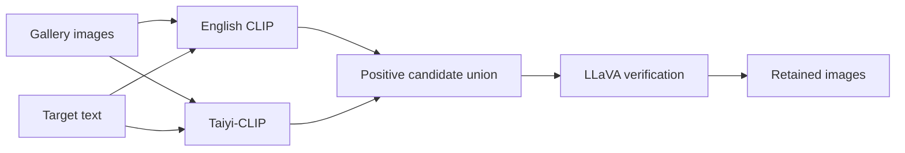
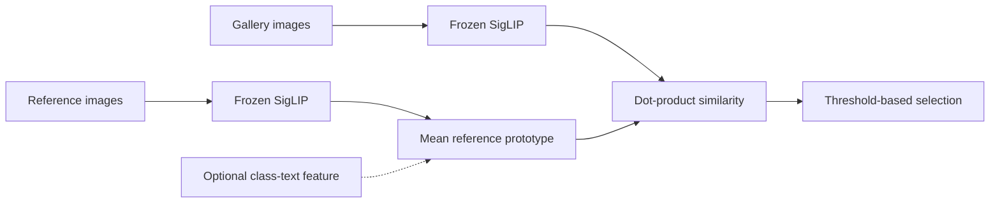

# A Multimodal Retrieval Framework for Unlabeled Image Collections

> **Historical project report.** Experimental figures follow the original project document, 《项目文档.pdf》. They are preserved as project records and were not recalculated or independently validated during repository preparation. See the [repository guide](README.md) for the code map, execution status and third-party attribution. Datasets and model weights are not distributed.

## Abstract

Retrieval from unlabeled image collections must accommodate different operating requirements. Content screening prioritizes recall, user-facing search prioritizes precision, and some visual concepts cannot be specified reliably in text. We evaluate a retrieval system that combines a two-stage image–text retrieval pipeline with an image-to-image retrieval framework to address these three cases. The two-stage pipeline first merges predictions from 2 different versions of CLIP to generate a high-recall candidate set, then uses LLaVA-based visual question answering to remove false positives. The image-to-image framework constructs a class prototype from a small set of reference images and retrieves gallery images based on the reference images. On a 2,000-image evaluation set with five target categories and category-specific hard negatives, the bilingual CLIP pipeline with LLaVA verification achieves 88.53% macro F1. In separate adaptation experiments using a 2,500-image training set, Tip-Adapter-F reaches 92.48% macro F1 without LLaVA verification. The reference-image module with image–text fusion reaches 86.06% macro F1. The system therefore supports text queries,  few-shot adaptation, and reference-image queries within one retrieval workflow.

## 1. Introduction

Image–text retrieval is one of the core capabilities in today’s multimodal field. As the volume of historical data accumulated by internet and AI companies—as well as image data stored on personal smartphones—continues to grow, efficiently leveraging multimodal large models to retrieve and manage these data has become critical to data governance. Vision–language models embed images and text in a shared space, allowing semantic similarity to be estimated directly. CLIP learns this space through large-scale contrastive image–text pretraining and transfers to visual recognition tasks without task-specific training (Radford et al., 2021).

Retrieval requirements differ by application. Risk-control pipelines prioritize recall because missing harmful content can be costly, whereas user-facing search prioritizes precision because irrelevant results degrade the search experience. We address these requirements with the following system components and evaluations:

1. A two-stage pipeline unions candidate predictions from English and Chinese CLIP prompts to increase recall, then applies an LLaVA verifier to remove false positives.
2. A comparison of Tip-Adapter and Tip-Adapter-F measures how cache-based adaptation changes English CLIP performance on the task-specific data.
3. A training-free image-to-image method constructs few-shot class prototypes and compares encoder choice, reference-set size, image–text fusion, and cluster-based reference selection.

## 2. Problem Formulation and Evaluation Protocol

Let \(\mathcal{G}=\{x_i\}_{i=1}^{M}\) denote an unlabeled candidate gallery and let \(c\) denote the target class. Depending on the retrieval mode, the query is either a text prompt \(q_c\) or a small reference set \(\mathcal{R}_c=\{r_j\}_{j=1}^{N}\). The system assigns a score \(s(x_i,c)\) to each gallery image and predicts the target class when

\[
\hat{y}_i = \mathbb{1}\left[s(x_i,c) \geq \tau_c\right],
\]

where \(\tau_c\) is a class-specific decision threshold. Precision, recall, and F1 are computed for each target category, and macro F1 is the unweighted mean across the five categories.

## 3. Retrieval Framework

### 3.1 Two-Stage Image–Text Retrieval

The two-stage pipeline explicitly separates candidate generation from candidate verification.

#### Stage 1: High-Recall Candidate Generation

An English CLIP model with a ViT-B/32 visual encoder and a Chinese Taiyi-CLIP model independently score each gallery image against the target prompt. For a target category \(c\), the candidate set is the deduplicated union

\[
\mathcal{C}_c = \mathcal{C}^{\mathrm{EN}}_c \cup \mathcal{C}^{\mathrm{ZH}}_c.
\]

An image enters the candidate set when either model predicts the target class. This rule favors recall but also admits false positives. The experiment tests whether the two models make sufficiently different errors for their union to improve candidate coverage.

#### Stage 2: Multimodal Verification

LLaVA-v1.5-7B, a multimodal instruction-following model derived from visual instruction tuning (Liu et al., 2023, 2024), verifies the retrieved candidates through binary visual question answering. The prompt follows the template:

> Is this an image of a {class}? Please answer with Yes or No.

The implementation rejects candidates whose generated answers contain “No.” CLIP performs the initial embedding-based screen, and LLaVA makes an image-conditioned decision on the resulting candidates.

### 3.2 Few-Shot Adaptation with Tip-Adapter

Zero-shot CLIP may suffer performance degradation when the target data differ substantially from its pretraining distribution. Tip-Adapter addresses this issue by constructing a key–value cache from few-shot labeled examples and retrieving relevant cache entries during inference (Zhang et al., 2022b). The training-free variant keeps the CLIP encoders fixed. Tip-Adapter-F fine-tunes only the cache keys initialized with CLIP visual features. Both variants combine the CLIP score with a cache score:

\[
s(x)=100 fW+\alpha\exp[-\beta(1-fK)]V,
\]

where \(f\) is the normalized image feature, \(W\) contains the text features, \(K\) contains the cache keys, and \(V\) contains fixed one-hot labels. Tip-Adapter keeps the initialized keys fixed; Tip-Adapter-F updates only \(K\) through cross-entropy. The CLIP encoders remain frozen. Predictions are evaluated directly from the fused scores, without LLaVA verification. 

### 3.3 Training-Free Image-to-Image Retrieval

Text queries require an accurate class name which is restrictive for visually specific concepts such as a particular porcelain style, a watermark pattern, or a previously observed harmful image type. In contrast, the image-to-image retrieval module enables users to specify the retrieval target using only a small set of reference images.

The image-to-image retrieval framework consists of three stages: reference-set encoding, prototype construction, and gallery ranking. Given a small set of reference images that represent the target concept, the system encodes both the references and the gallery images using a pretrained vision encoder. It then classifies each gallery image according to whether it belongs to the category represented by the query prototype.

The reference images are removed from the candidate gallery before evaluation to prevent direct sample overlap. The project evaluates two prototype refinements:

- **Image–text fusion:** For each reference image, we construct a fused feature by averaging its normalized image feature with the text feature of the prompt “a photo of a {class}.” The fused features are then averaged to construct the query prototype. This variant introduces a semantic prior when a usable class label is available.
- **Cluster-selected references:** Given multiple candidate reference images, we apply K-means clustering and select the images closest to the cluster centroids. The selected images are then used to construct the query prototype by averaging their features.

*Figure 1. Two retrieval pipelines. The first takes the union of bilingual CLIP candidates and verifies them with LLaVA. The second compares gallery features with a mean reference prototype; optional refinements include reference selection by clustering and class-text fusion. These abstract diagrams describe the mechanisms and contain no dataset photographs or measured predictions.*

## 4. Experiments

### 4.1 Implementation Details

**Datasets.** We evaluate retrieval on five target categories: Dog, Duck, Erhu, Piano, and Porcelain. Each category contributes 200 positive images and 200 category-specific hard negatives, for a total of 2,000 images. For Tip-Adapter-F fine-tuning, we build a dataset consisting of 2,500 images, with 500 images from each of the five target categories to fine-tune cache keys of Tip-Adapter-F. For image-to-image retrieval, we sample reference images from the target category and exclude them from the evaluation gallery. We use reference-set sizes of 1, 5, 10, and 20 with a fixed sampling seed of 0.

**Evaluation Metrics and Protocol.** We formulate retrieval as a one-versus-rest binary classification problem for each target category and report precision, recall, and F1. We use macro F1 as the primary metric for comparing overall performance across methods, computed as the unweighted mean of the F1 scores across the five target categories. For threshold-based retrieval, we select a separate threshold for each category by maximizing its category-level F1 on the labeled evaluation gallery.

**Compared Methods.** For the two-stage retrieval pipeline, we compare OpenAI CLIP ViT-B/32 (Radford et al., 2021), IDEA-CCNL Taiyi-CLIP RoBERTa-large-326M-Chinese (Zhang et al., 2022a), their prediction union, and the union followed by LLaVA-v1.5 verification (Liu et al., 2024). The adaptation experiments compare zero-shot CLIP, training-free Tip-Adapter, and Tip-Adapter-F (Zhang et al., 2022b). For image-to-image retrieval, we compare SigLIP (Zhai et al., 2023) mean image prototypes, image–text fusion, and prototypes constructed from cluster-selected references.

### 4.2 Main Results

**Candidate Generation and Verification.** We next evaluate whether combining the two CLIP models improves candidate recall and whether LLaVA verification removes false positives introduced by the union operation.

**Table 1. Results of the two-stage retrieval pipeline.**

| Configuration | Precision | Recall | Macro F1 |
| --- | ---: | ---: | ---: |
| OpenAI CLIP ViT-B/32 | 0.7484 | 0.9070 | 0.8162 |
| IDEA-CCNL Taiyi-CLIP RoBERTa-large-326M-Chinese | 0.8066 | 0.9480 | 0.8751 |
| Bilingual union | 0.7470 | **0.9780** | 0.8313 |
| Bilingual union + LLaVA verification | 0.8000 | 0.9520 | **0.8853** |

Taking the union of the two CLIP prediction sets increases recall to 97.80%, which is 7.10 points higher than OpenAI CLIP. This gain in coverage reduces precision to 74.70% and macro F1 to 83.13%. LLaVA verification then raises precision to 80.00% while retaining 95.20% recall, producing the highest macro F1 of 88.53%. These results support the intended division of labor in the two-stage pipeline: the bilingual union improves recall, which prioritizes candidate coverage, while LLaVA removes false positives to restore overall retrieval quality.

**Adaptation with Labeled Examples.** Table 2 compares the effect of adding a labeled cache and then fine-tuning its keys. Both variants improve on the reported zero-shot baseline at every shot setting. Training-free Tip-Adapter gains 8.93–10.37 percentage points in macro F1, and Tip-Adapter-F provides an additional gain at each setting. At 500 shots, Tip-Adapter-F reaches 92.48%, exceeding Tip-Adapter by 1.40 points.

**Table 2. Adaptation results from the project summary.** K-shot denotes K training images from the target class and K training images from the Others class.

| Shots | Zero-shot CLIP | Tip-Adapter | Tip-Adapter-F |
| ---: | ---: | ---: | ---: |
| 10 | 0.8071 | 0.9049 | **0.9053** |
| 100 | 0.8071 | 0.8964 | **0.9040** |
| 200 | 0.8071 | 0.9018 | **0.9196** |
| 500 | 0.8071 | 0.9108 | **0.9248** |

The reported gains suggest that adding the cache accounts for most of the performance improvement, with further gains from learning its keys.

**Prototype Construction.** We compare three SigLIP prototype constructions for reference-image queries. With the reference count and sampling rule fixed, adding a class-text feature raises macro F1 from 79.60% to 86.06%, a gain of 6.46 percentage points (Table 3). This result supports incorporating a class-name prior when one is available. Image-only prototypes remain applicable to concepts specified entirely through examples.

**Table 3. Prototype-construction results.** Image-only and fusion scores average saved class-level outputs. The cluster-selection score averages class-level values from the project summary. Its different reference pool and gallery make it an exploratory comparison.

| Prototype construction | Reference candidates excluded from gallery | Images used in prototype | Macro F1 |
| --- | ---: | ---: | ---: |
| Mean image feature | 20 | 20 | 0.7960 |
| Mean image feature + class-text feature | 20 | 20 | **0.8606** |
| Mean of cluster-selected image features | 50 | 20 | 0.7707 |

Cluster selection yields a lower recorded aggregate score than the direct mean prototype. It also changes the evaluation conditions: 50 images are withheld to select 20 representatives, whereas the baseline withholds 20 images. The score difference therefore reflects changes in both reference selection and the gallery. Isolating the effect of clustering requires a shared gallery and reference-candidate pool.

### 4.3 Further Analysis

**Selection of the Classification Protocol.** We compare three scoring protocols with OpenAI CLIP ViT-B/32. Thresholded one-versus-rest classification produces the highest macro F1 and is used in the remaining experiments.

**Table 4. Comparison of classification protocols.**

| Protocol | Macro F1 |
| --- | ---: |
| Five target classes plus an Other class | 0.6590 |
| Unthresholded one-versus-rest classification | 0.3989 |
| Thresholded one-versus-rest classification | **0.8162** |

Class-specific thresholds better capture the target-versus-background decision than a single relative ranking across all categories.

**Effect of the Adaptation Sample Budget.** Performance does not improve monotonically with the nominal shot count (Table 2). For both Tip-Adapter and Tip-Adapter-F, the 100-shot score is lower than the 10-shot score. Fine-tuning adds 0.04 F1 points at 10 shots, compared with 1.78 points at 200 shots and 1.40 points at 500 shots. Although these gains are larger at the higher shot counts, the recorded learning rate also changes, so the effect cannot be attributed to sample count alone. Tip-Adapter-F gains a further 0.52 points from 200 to 500 shots. Repeated sampling with fixed optimization settings would help separate sample-budget effects from sample composition and training choices.

**Effect of Reference-Set Size and Encoder Configuration.** We vary the reference-set size from 1 to 20 to assess feature averaging with OpenAI CLIP ViT-B/32 and SigLIP. The scores are macro F1 values averaged across the five target categories.

**Table 5. Reference-set size and encoder comparison.** Entries are macro F1.

| Reference images | OpenAI CLIP ViT-B/32 | SigLIP |
| ---: | ---: | ---: |
| 1 | 0.7048 | 0.6991 |
| 5 | 0.6686 | 0.7620 |
| 10 | 0.6836 | 0.7804 |
| 20 | 0.6770 | 0.7960 |

SigLIP improves from 69.91% macro F1 with one reference to 79.60% with 20. In contrast, OpenAI CLIP does not improve as the reference count increases and achieves its highest score, 70.48%, with one reference. SigLIP outperforms OpenAI CLIP and benefits from larger reference sets.

**Category-Level Effects of Prototype Refinement.** Table 6 compares the three prototype constructions by category.

**Table 6. Category-level F1 for SigLIP prototype variants.** Image-only and fusion scores come from saved outputs. Cluster-selection scores come from the project summary and use the different gallery specified in Table 3. Bold marks the higher score within each image-only/fusion pair.

| Category | Image only | Image–text fusion | Cluster selection |
| --- | ---: | ---: | ---: |
| Dog | 0.7239 | **0.8835** | 0.6617 |
| Duck | 0.7966 | **0.8421** | 0.7803 |
| Erhu | 0.7205 | **0.9239** | 0.6855 |
| Piano | **0.8888** | 0.8289 | 0.8681 |
| Porcelain | **0.8501** | 0.8247 | 0.8580 |

## 5. Discussion

For the evaluated setting, the results suggest the following operating choices:

- **Recall-critical screening:** use the bilingual CLIP union to minimize missed candidates.
- **Balanced retrieval:** add LLaVA verification when the computational budget permits a second-stage semantic decision.
- **Domain adaptation:** use Tip-Adapter when a labeled few-shot set is available and repeated queries justify cache construction.
- **Unnamed visual concepts:** use the image-only prototype with several reference examples.
- **Named but visually diverse concepts:** consider image–text prototype fusion, subject to class-specific validation.

The choice among these modes depends on the query input and computation available at inference. LLaVA verification uses a generative model and is likely more expensive than embedding similarity. Tip-Adapter requires labeled examples. Image-only prototype retrieval requires only representative images. Image–text fusion has the highest average prototype score but requires the class name that image-to-image retrieval is intended to avoid.

## 6. Limitations and Threats to Validity

The current results should be interpreted as evidence from a project-scale comparative study rather than as a definitive benchmark.

1. **The category set is small.** Five target categories and their hard negatives do not represent the full diversity of content moderation, product retrieval, or personal photo search. Evaluation should be extended to more categories, multi-label images, open-set distractors, and distribution shifts.
2. **The threshold is label-dependent.** Although inference operates over an unlabeled gallery, threshold optimization currently requires labeled evaluation data. Deployment on a new category therefore needs either a labeled calibration set, an unsupervised calibration strategy, or a transferable threshold model.
3. **Hybrid prototypes do not solve the fully unnamed-query case.** Image–text fusion assumes that a class label is available. Its strong average result should not be interpreted as evidence that it replaces image-only retrieval for targets that cannot be verbalized.

## 7. Conclusion and Future Work

This project demonstrates the practical value of modular multimodal retrieval: a single workflow can support recall-critical screening, precision-oriented search, few-shot domain adaptation, and queries defined only by reference images. The two-stage pipeline uses bilingual CLIP models to increase candidate recall and LLaVA to filter false positives, reaching 88.53% macro F1. In the adaptation experiments, the 500-shot Tip-Adapter-F setting raises the English CLIP baseline to 92.48% macro F1. For image-based queries, SigLIP with 20 references reaches 79.60% macro F1, and optional image–text fusion raises the five-class average to 86.06%.

## References

Liu, H., Li, C., Wu, Q., & Lee, Y. J. (2023). Visual instruction tuning. In *Advances in Neural Information Processing Systems* (Vol. 36, pp. 34892–34916). https://doi.org/10.52202/075280-1516

Liu, H., Li, C., Li, Y., & Lee, Y. J. (2024). Improved baselines with visual instruction tuning. In *Proceedings of the IEEE/CVF Conference on Computer Vision and Pattern Recognition* (pp. 26296–26306). https://openaccess.thecvf.com/content/CVPR2024/html/Liu_Improved_Baselines_with_Visual_Instruction_Tuning_CVPR_2024_paper.html

Radford, A., Kim, J. W., Hallacy, C., Ramesh, A., Goh, G., Agarwal, S., Sastry, G., Askell, A., Mishkin, P., Clark, J., Krueger, G., & Sutskever, I. (2021). Learning transferable visual models from natural language supervision. In *Proceedings of the 38th International Conference on Machine Learning* (Vol. 139, pp. 8748–8763). PMLR. https://proceedings.mlr.press/v139/radford21a.html. Model: [openai/clip-vit-base-patch32](https://huggingface.co/openai/clip-vit-base-patch32).

Zhai, X., Mustafa, B., Kolesnikov, A., & Beyer, L. (2023). Sigmoid loss for language image pre-training. In *Proceedings of the IEEE/CVF International Conference on Computer Vision* (pp. 11941–11952). https://doi.org/10.1109/ICCV51070.2023.01100

Zhang, J., Gan, R., Wang, J., Zhang, Y., Zhang, L., Yang, P., Gao, X., Wu, Z., Dong, X., He, J., Zhuo, J., Yang, Q., Huang, Y., Li, X., Wu, Y., Lu, J., Zhu, X., Chen, W., Han, T., Pan, K., Wang, R., Wang, H., Wu, X., Zeng, Z., & Chen, C. (2022a). Fengshenbang 1.0: Being the foundation of Chinese cognitive intelligence. *arXiv*. https://doi.org/10.48550/arXiv.2209.02970. Model: [IDEA-CCNL/Taiyi-CLIP-Roberta-large-326M-Chinese](https://huggingface.co/IDEA-CCNL/Taiyi-CLIP-Roberta-large-326M-Chinese).

Zhang, R., Zhang, W., Fang, R., Gao, P., Li, K., Dai, J., Qiao, Y., & Li, H. (2022b). Tip-Adapter: Training-free adaption of CLIP for few-shot classification. In *Computer Vision – ECCV 2022* (Vol. 13695, pp. 493–510). Springer. https://doi.org/10.1007/978-3-031-19833-5_29
