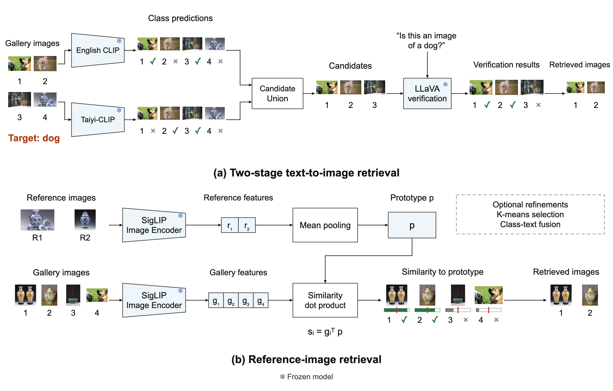

# Multimodal Retrieval from Unlabeled Image Collections

A research code portfolio exploring how to retrieve images using text queries, a small labeled cache, or reference images. 

The project compares three complementary approaches:

- **Two-stage text-to-image retrieval:** combine CLIP and Taiyi-CLIP candidates, then use LLaVA visual question answering to verify candidates.
- **Task adaptation:** adapt Tip-Adapter and Tip-Adapter-F to improve the retrieval capability.
- **Reference-image retrieval:** construct an image prototype and explore encoder choice, reference-set size, image–text fusion, and clustering.

## Framework

[](docs/assets/retrieval_framework.png)

*Framework diagram from the project report's figure assets. (a) English CLIP and Taiyi-CLIP generate a candidate union, followed by LLaVA verification. (b) SigLIP encodes reference images and gallery images for prototype-based retrieval. Predictions, similarity bars, and retrieved examples in this diagram illustrate the workflow; they are not measured model outputs. Click the image to view it at full resolution.*

Tip-Adapter is a separate adaptation experiment: a labeled feature cache augments the frozen CLIP score, and Tip-Adapter-F learns the cache keys. It is evaluated without the LLaVA verifier.

## Experiment Results

### Two-stage retrieval pipeline

**Table 1. Results of the two-stage retrieval pipeline.**

| Configuration                                   | Precision |     Recall |   Macro F1 |
| ----------------------------------------------- | --------: | ---------: | ---------: |
| OpenAI CLIP ViT-B/32                            |    0.7484 |     0.9070 |     0.8162 |
| IDEA-CCNL Taiyi-CLIP RoBERTa-large-326M-Chinese |    0.8066 |     0.9480 |     0.8751 |
| Bilingual union                                 |    0.7470 | **0.9780** |     0.8313 |
| Bilingual union + LLaVA verification            |    0.8000 |     0.9520 | **0.8853** |

**Table 2. Adaptation results from the project summary.** K-shot denotes K training images from the target class and K training images from the Others class.

| Shots | Zero-shot CLIP | Tip-Adapter | Tip-Adapter-F |
| ----: | -------------: | ----------: | ------------: |
|    10 |         0.8071 |      0.9049 |    **0.9053** |
|   100 |         0.8071 |      0.8964 |    **0.9040** |
|   200 |         0.8071 |      0.9018 |    **0.9196** |
|   500 |         0.8071 |      0.9108 |    **0.9248** |

### Image-to-image retrieval

**Table 3. Prototype-construction results.** Image-only and fusion scores average saved class-level outputs. The cluster-selection score averages class-level values from the project summary. Its different reference pool and gallery make it an exploratory comparison.

| Prototype construction                  | Reference candidates excluded from gallery | Images used in prototype |   Macro F1 |
| --------------------------------------- | -----------------------------------------: | -----------------------: | ---------: |
| Mean image feature                      |                                         20 |                       20 |     0.7960 |
| Mean image feature + class-text feature |                                         20 |                       20 | **0.8606** |
| Mean of cluster-selected image features |                                         50 |                       20 |     0.7707 |

## Repository contents

```text
retrieval/
├── README.md
├── Multimodal_Retrieval_Research_Project_Report.md
├── THIRD_PARTY_NOTICES.md
├── requirements.txt
├── project_paths.py
├── docs/                         # Setup and the final homepage framework figure
├── two_stage_retrieval/           # English/Chinese scoring and LLaVA verification
├── tip_adapter_ft/                # Tip-Adapter adaptation code and configuration
└── image_to_image_retrieval/      # Reference-prototype notebooks and SigLIP inference
```

Datasets, weights, caches, local figure drafts and machine-specific files are excluded by `.gitignore`. The homepage includes the report’s framework figure with illustrative image thumbnails; the source datasets are not included. No dataset or model redistribution rights are granted by this repository; see [third-party notices](THIRD_PARTY_NOTICES.md).

## AI Assistance Statement

Selected parts of the code and documentation were refined using AI tools after the initial versions were written by the author. AI assistance was used for code cleanup and English-language editing.
